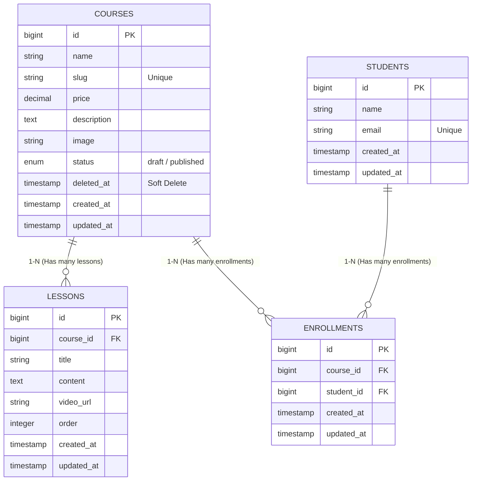

# TÀI LIỆU MÔ TẢ DỰ ÁN - COURSE MANAGEMENT SYSTEM (CMS)

## 1. Mô tả chức năng bài toán
Dự án là một hệ thống quản lý khóa học trực tuyến (LMS Mini), cho phép người quản trị:
- **Quản lý khóa học**: Tạo mới (có upload ảnh, tự sinh slug), cập nhật, xóa tạm thời (Soft Delete) và khôi phục khóa học.
- **Quản lý bài học**: Mỗi khóa học chứa nhiều bài học được sắp xếp theo thứ tự (order). Hỗ trợ xem danh sách bài học theo từng khóa.
- **Quản lý đăng ký (Enrollment)**: Ghi danh học viên (Tên, Email) vào các khóa học cụ thể.
- **Dashboard Thống kê**: Theo dõi tổng số khóa học, tổng học viên, tổng doanh thu (giả lập), khóa học "hot" nhất và các khóa học mới cập nhật.
- **Tìm kiếm & Lọc**: Hệ thống hỗ trợ tìm kiếm theo tên, lọc theo trạng thái (Draft/Published), lọc giá và sắp xếp theo nhiều tiêu chuẩn (Giá, Số học viên, Số bài học...).

---

## 2. Sơ đồ ERD (Entity Relationship Diagram)

---

## 3. Phác thảo giao diện (UI Sketch)

### A. Layout Master
- **Sidebar (Trái)**: Logo "EduMaster", Menu điều hướng (Dashboard, Khóa học, Bài học, Đăng ký).
- **Main Content (Phải)**: Header trang, Thông báo Alert Success/Error và nội dung chính của từng chức năng.

### B. Dashboard
- **Top Row**: 4 Thẻ Card thống kê (Tổng khóa học, Tổng học viên, Doanh thu, Top Course).
- **Bottom Table**: Danh sách 5 khóa học mới nhất với ảnh minh họa và Badge trạng thái màu sắc.

### C. Khóa học (Index)
- **Header**: Nút "Thêm mới" và nút "Thùng rác".
- **Filter Section**: Thanh tìm kiếm + Các Select box (Trạng thái, Sắp xếp theo, Thứ tự).
- **Main Table**: Hiển thị ảnh (nếu có), Tên, Giá, Trạng thái (Green/Red Badge), Số lượng bài học.

### D. Form Thêm/Sửa
- Các Input field được thiết kế tập trung, có `validation` hiển thị lỗi ngay trên đầu trang.
- Hỗ trợ xem trước ảnh cũ khi cập nhật khóa học.
